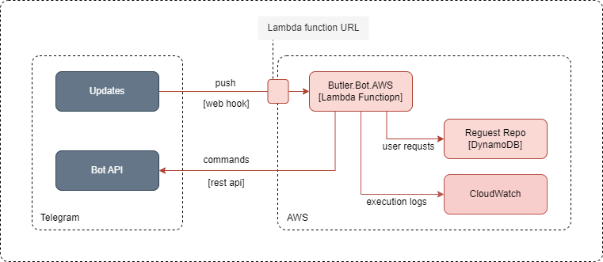
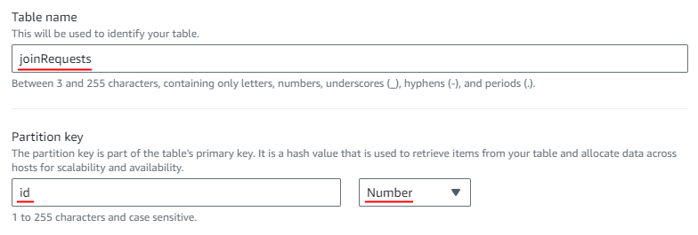
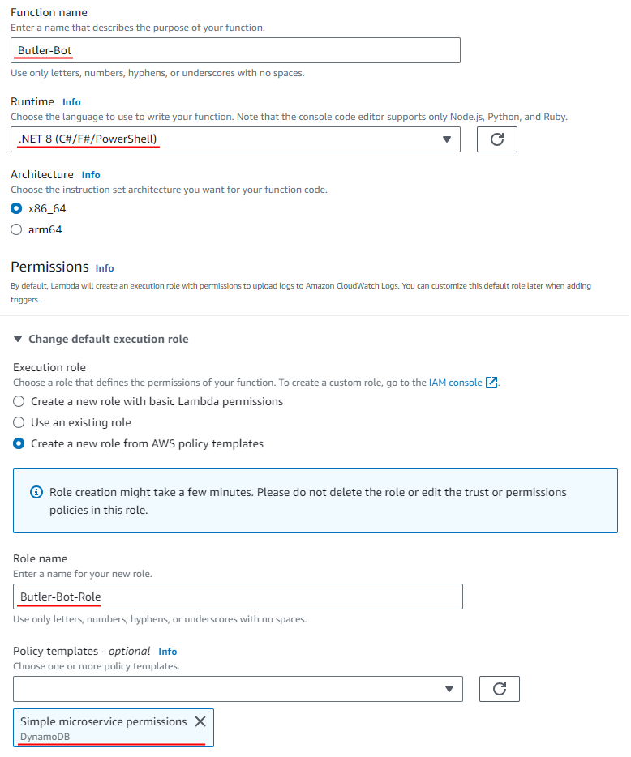
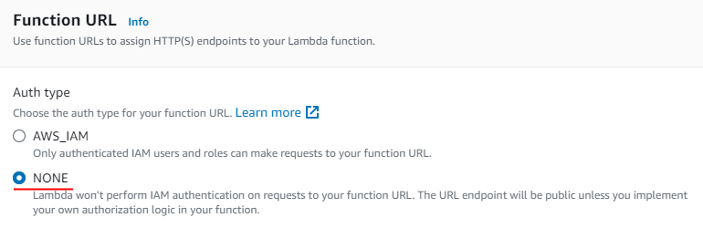
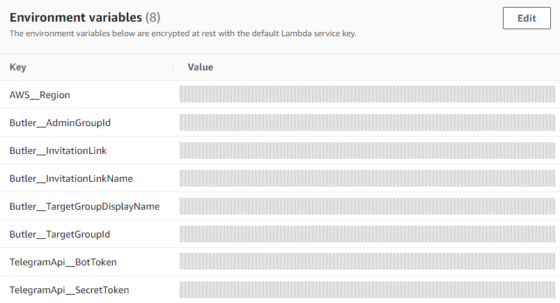
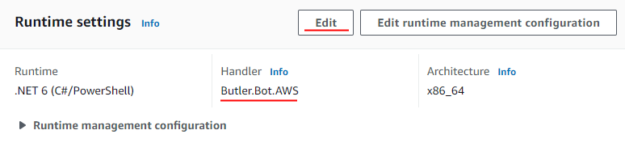
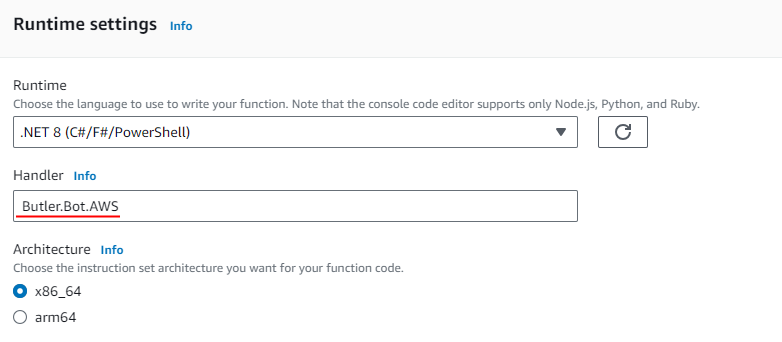
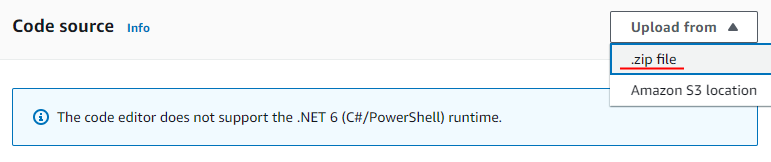
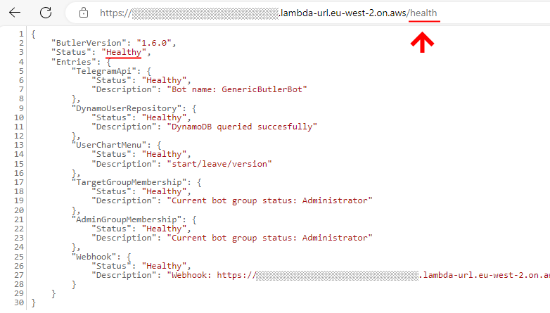

# AWS Deployment
**Butler.Bot.AWS** uses [AWS Lambda](https://aws.amazon.com/lambda) as an execution engine and [AWS DynamoDB](https://aws.amazon.com/dynamodb) as a state storage.

There are different deployment models possible with AWS Lambda. You may consider usage of API Gateway and VPC if you see them useful in your particular case.

Below are the steps required for the simplest deployment mode. It utilizes [AWS Free Tier](https://aws.amazon.com/free) which means your bot might be always free in most of the cases.

## 1. Create AWS account

If you do not have already, or want to have a separate one for the bot, go to [aws.amazon.com](https://aws.amazon.com/) and create new account.

## 2. Select region

Select region for your deployment. There are no preferences here. Select which one you like most.

## 3. Create DynamoDB table

Goto AWS Console for DynamoDB in selected region and create new table to store user requests. 

It should be named "joinRequests" and should have "id" as partition key.

All other parameters might default

## 4. Create Lambda Function

Goto AWS Console for Lambda in selected region and create new Lambda function.

Select .Net 6 Runtime and create the new role with enough permissions to call DynamoDB (Simple microservice template is enough. Feel free to select it.)

## 5. Create function url

Goto configuration of the new function and create function url without auth

Remember you function url. It will be base url for your bot webhook

## 6. Setup environment variables

Goto configuration panel and setup the following environment variables for the lambda function.

DynamoDB:
* **AWS__Region** (string) - AWS region where DynamoDB table is created. 

Telegram API:
* **TelegramApi__BotToken** (string) - Token provided by @botfather during bot registration.
* **TelegramApi__SecretToken** (string) - Token generated during webhook registration via setWebhook.

Butler settings:
* **Butler__TargetGroupDisplayName** (string) - Display name of the target group used by the bot in private messages.
* **Butler__TargetGroupId** (long) - Telegram id of the target group.
* **Butler__AdminGroupId** (long) - Telegram id of admin group.
* **Butler__InvitationLink** (string) - Progenerated invite link used by the bot to invite new members.
* **Butler__InvitationLinkName** (string) - Name of the invite link. Bot accept join requests only from this link. All other invite requests are ignored.

Please check [Configuration.md](Configuration.md) for the full list of supported parameters.

## 7. Update Lambda Handler

Goto Lambda>Code>Runtime settings and change handler to "Buttler.Bot.AWS"

## 8. Deploy Lambda Code

Goto Lambda>Code and deploy **Buttler.Bot.AWS.zip** manually

## 9. All done

You bot backend is ready to work. Go to **/health** url and check the status. It should be healthy in all rows.

