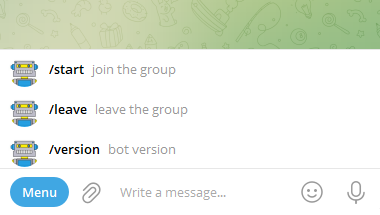

# Butler.Bot Creation

To create your own instance of **Butler.Bot** please follow the steps below. 

## 1. Create your bot
Go to [@botfather](https://t.me/botfather) and create new bot. Be creative. Select proper name, image and description.

## 2. Remember bot token
After bot is create remember bot token it will be required for backend configuration.

## 3. Add bot into your managed group
Goto your managed group and add bot as administrator. From the image below, bot needs to have permissions for:
* Delete messages
* Ban users
* Invite users via link

## 4. Add bot into your admin group

Add bot into admin group as a member. Administrator permissions are not required for admin group.

## 5. Create invite link which will be used by bot
Go to you managed group and generate new invite link. Switch on admin approvals and remove time limit.

Remember both: invite link and its name. They will be required for bot configuration. 

## 6. Get telegram id of your managed and admin groups

Open Telegram Desktop. Goto you managed group and copy url to any message. It contains group id inside.

Remember group id for your managed and admin groups. They will be required for bot configuration.

## 7. Generate webhook secret

Do some magic and generate secret for [bot webbhook](https://core.telegram.org/bots/api#setwebhook). It will be sent in a header “X-Telegram-Bot-Api-Secret-Token” in every webhook request, 1-256 characters.

Remember secret. It will be required for bot configuration.

## 8. Download or build lambda deployment package

Goto GitHub and download [latest release binaries](https://github.com/eseuruk/Butler.Bot/releases) for Butler.Bot.AWS. Or build them from the sources. 

## 9. Deploy bot backend to AWS

Deploy bot backend to AWS [as described here](AwsDeployment.md).

You will need parameters from 2, 5, 6 and 7 to configure lambda function.

## 10. Update webhook with the url from 9

Update [bot webhook](WebHook.md) with the url of AWS Lambda functions created at step 9

## 11. Setup bot command menu for provate chats 

If you want bot command menu to be visable in the private chat, please follow [the instructions](BotMenu.md)

## 12. All done

Say hello to your new bot!

