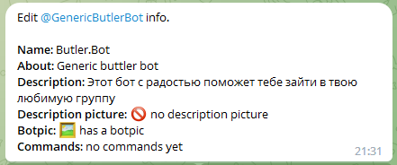
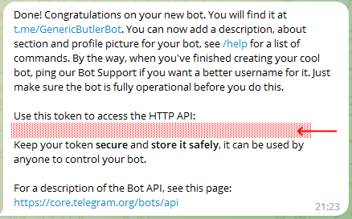
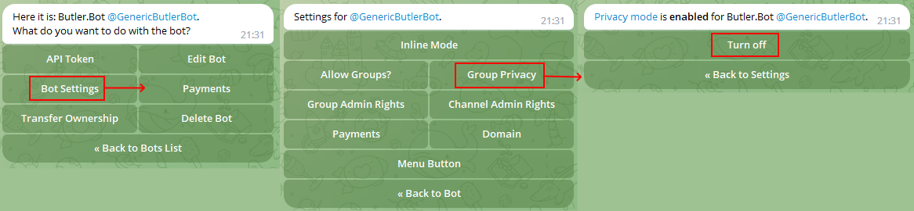
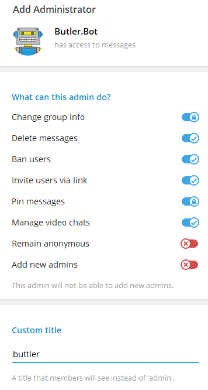
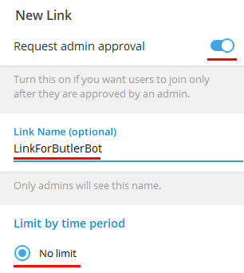
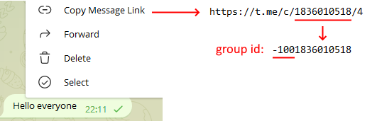
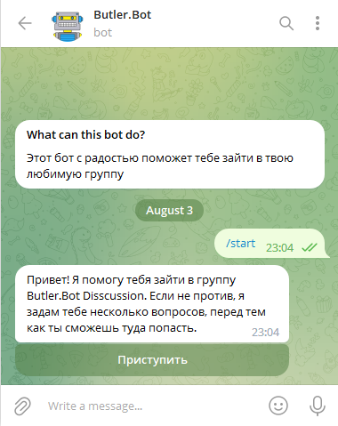

# Butler.Bot Creation

To create your own instance of **Butler.Bot** please follow the steps below. 

## 1. Create your bot
Go to [@botfather](https://t.me/botfather) and create new bot. Be creative. Select proper name, image and description.



## 2. Remember bot token
After bot is create remember bot token it will be required for backend configuration.



## 3. Switch off group privacy mode

Swith off [privacy mode](https://core.telegram.org/bots/features#privacy-mode) to allow bot reading chat messages



## 4. Add bot to your managed and admin groups
Goto your managed group and add bot as administrator. Bot need to see messages and approve join requests.

Do the same for your admin group if you use one.



## 5. Create invite link which will be used by bot
Go to you managed group and generate new invite link. Switch on admin approvals and remove time limit.

Remember both: invite link and its name. They will be required for bot configuration.



## 6. Get telegram id of your managed and admin groups

Open Telegram Desktop. Goto you managed group and copy url to any message. It contains group id inside.

Remember group id for your managed and admin groups. They will be required for bot configuration.



## 7. Generate webhook secret

Do some magic and generate secret for [bot webbhook](https://core.telegram.org/bots/api#setwebhook). It will be sent in a header “X-Telegram-Bot-Api-Secret-Token” in every webhook request, 1-256 characters.

Remember secret. It will be required for bot configuration.

## 8. Download or build lambda deployment package

Goto GitHub and download latest release binaries. Or build them from the sources. 

## 9. Update configuration file with values from 2, 5, 6 and 7

Put values from the previous steps to **[appsettings.json](Configuration.md)** inside **Butler.Bot.AWS.zip**
```json
  "AWS": {
    "Region": <AWS-REGION>
  },
  "TelegramApi": {
    "BotToken": <BOT-TOKEN>,
    "SecretToken": <SECRET-TOKEN>,
    "SecretTokenValidation": true
  },
  "Butler": {
    "TargetGroupDisplayName": <TARGET-GROUP-NAME>,
    "TargetGroupId": <TARGER-GROUP-ID>,
    "AdminGroupId": <ADMIN-GROUP-ID>,
    "InvitationLink": <INVITATION-LINK>,
    "InvitationLinkName": <INVITATION-LINK-NAME>,
    "MinWoisLength": 120,
    "WhoisReviewMode": "PostJoin"
  }
```

Do not forget to configure AWS region. It is used by DynamoDB client.

## 10. Deploy bot backend to AWS

Deploy bot backend to AWS [as described here](AwsDeployment.md)

## 11. Update webhook with the url from 9

Update [bot webhook](/WebHook.md) with the url of AWS Lambda functions created at step 9

## 12. All done

Say hello to your new bot!


