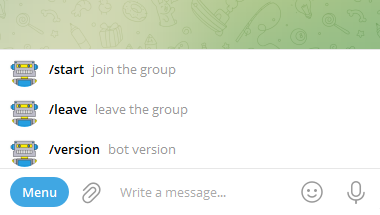

# Bot Menu

If you want bot command menu to be visable in the private chat, please follow the instructions bellow.

Windows and Linux shell scripts are available in [/Commands](../Commands) folder.



* To make bot menu visable in the private chat

```bat
REM your bot token
SET BotToken=XXXXXXXXXXXXXXXXXXXXXXXXXXXXX

REM bot menu commands
SET "Commands=[{\"command\":\"start\",\"description\":\"join the group\"}, {\"command\":\"leave\",\"description\":\"leave the group\"}, {\"command\":\"version\",\"description\":\"bot version\"}]"

REM menu scope for private chats only
SET "Scope={\"type\":\"all_private_chats\"}"

curl "https://api.telegram.org/bot%BotToken%/setMyCommands" --header "Content-Type: application/json" --data "{\"commands\":%Commands%, \"scope\":%Scope%}" 
```

* To see the current settings of private chat menu 
 
```bat
REM your bot token
SET BotToken=XXXXXXXXXXXXXXXXXXXXXXXXXXXXX

REM menu scope for private chats only
SET "Scope={\"type\":\"all_private_chats\"}"

curl --get "https://api.telegram.org/bot%BotToken%/getMyCommands" --data-urlencode scope="%Scope%"
```

* To delete private chat menu 

```bat

REM your bot token
SET BotToken=XXXXXXXXXXXXXXXXXXXXXXXXXXXXX

REM menu scope for private chats only
SET "Scope={\"type\":\"all_private_chats\"}"

curl --get "https://api.telegram.org/bot%BotToken%/deleteMyCommands" --data-urlencode scope="%Scope%"
```
